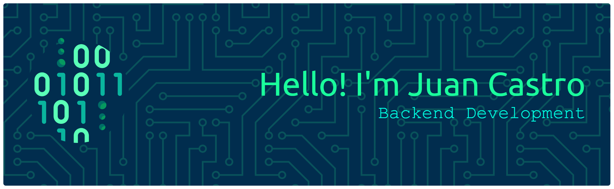

# Juan Castro Backend Developer

## About Me

I'm a programming student with a strong passion for problem-solving and continuous learning.

Throughout my academic journey, I have participated in mathematics competitions, including team-based challenges that strengthened my analytical thinking, collaboration skills, and ability to approach complex problems from different perspectives. Beyond academics, I have also been involved in volunteer work and workshops organized by NGOs, experiences that helped me develop leadership, teamwork, and a commitment to creating a positive impact in my community.

Technology has always fascinated me. Since I first discovered programming, I knew I wanted to become a software developer and contribute to the code that powers the modern world. This passion led me to focus on Backend Development, where I enjoy designing logical solutions, building reliable systems, and understanding how applications work behind the scenes.

## Languages

## Backend

## Databases

## Tools

## Featured Projects

## Featured projects

Below you will find projects that document my learning process and showcase my growth as a developer.

